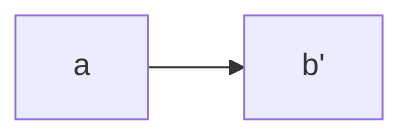

[Ref 1](https://www.geeksforgeeks.org/orientation-3-ordered-points/) - [Ref 2](https://www.geeksforgeeks.org/convex-hull-set-1-jarviss-algorithm-or-wrapping/)

Gần đây khi làm việc với Aegisub và các công cụ karaoke, tôi nhận thấy việc tạo ra các hiệu ứng phức tạp liên quan đến hình học không đơn giản.

Ví dụ nếu muốn tạo hiệu ứng vỡ chữ sang các mảnh tam giác, ta cần đến thuật toán Jarviss hoặc Graham và Delauney. Trong đó:

- **Jarviss** hoặc **Graham**: Dùng để tìm ra convex hull - bao lồi - là hình bao ngoài chứa tất cả các điểm đầu vào.
- **Delauney**: Thuật toán chia convex hull thành các mảnh tam giác sao cho không có tam giác nào chồng lên nhau.

<!-- truncate -->

## Thuật toán Jarviss



__Thuật toán Jarvis__ hay còn gọi là thuật toán chiều kim đồng hồ. Ý tưởng:

- Ta bắt đầu từ điểm bên trái nhất (điểm có tọa độ `x` nhỏ nhất).
- Từ điểm `x` này ta sẽ tiến hành "bao" các điểm còn lại theo hướng ngược chiều kim đồng hồ.

Vậy câu hỏi là, làm sao xác định được điểm tiếp theo? Câu trả lời là __xét hướng__.

### Xác định hướng của 3 điểm (clockwise)

Có 3 điểm nằm trên mặt phẳng tọa độ. Hướng quay của 3 điểm có thể là:

- Ngược chiều kim đồng hồ (counterclockwise).
- Thuận chiều kim đồng hồ (clockwise).
- Thẳng góc (3 điểm nằm trên một đường thẳng - collinear).

Ta có sơ đồ sau:

- Nếu chiều của (p1, p2, p3) là thẳng góc thì chiều của (p3, p2, p1) cũng thẳng góc.
- Nếu chiều của (p1, p2, p3) thuận kim đồng hồ, thì chiều của (p3, p2, p1) ngược kim đồng hồ và điều ngược lại cũng đúng.

Ví dụ:

```
Đầu vào:   p1 = {0, 0}, p2 = {4, 4}, p3 = {1, 2}
Đầu ra:  CounterClockWise

Đầu vào:   p1 = {0, 0}, p2 = {4, 4}, p3 = {1, 1}
Đầu ra:  Colinear
```

Làm sao để tính? Ý tưởng là tính ra độ dốc:


Độ dốc của 2 điểm (p1, p2): σ = (y2 - y1)/(x2 - x1)
Độ dốc của 2 điểm (p2, p3): τ = (y3 - y2)/(x3 - x2)

Nếu `σ > τ`, hướng sẽ là thuận kim đồng hồ (quay phải).

Sử dụng các giá trị `σ` và `τ` trên, ta kết luận: Hướng của 3 điểm phụ thuộc vào dấu của biểu thức sau:

```python
(y2 - y1)*(x3 - x2) - (y3 - y2)*(x2 - x1)
```

Nếu giá trị trả về của biểu thức trên là âm thì tức là ngược chiều kim đồng hồ.

Code thuật toán:

import Tabs from '@theme/Tabs';
import TabItem from '@theme/TabItem';

<Tabs
  defaultValue="python"
  values={[
    {label: 'Java', value: 'java'},
    {label: 'Python', value: 'python'},
]}>
<TabItem value="java">

```java
class Point {
  int x, y;

  Point(int x, int y) {
    this.x = x;
    this.y = y;
  }
}

class Clocker {
    // Để tìm ra hướng của 3 điểm
    // (p1, p2, p3). Hàm này trả về
    // các giá trị sau:
    // 0 --> p, q và r thẳng hàng
    // 1 --> Thuận kim đồng hồ
    // 2 --> Ngược kim đồng hồ
    public static int orientation(Point p1, Point p2,
                                  Point p3) {
        int val = (p2.y - p1.y) * (p3.x - p2.x) -
                (p2.x - p1.x) * (p3.y - p2.y);

        if (val == 0) return 0;  // colinear

        return (val > 0) ? 1 : 2;
    }

    public static void main(String[] args) {
        Point p1 = new Point(0, 0);
        Point p2 = new Point(4, 4);
        Point p3 = new Point(1, 2);

        int o = orientation(p1, p2, p3);

        if (o == 0)
            System.out.print("Linear");
        else if (o == 1)
            System.out.print("Clockwise");
        else
            System.out.print("CounterClockwise");

    }
}
```

</TabItem>
<TabItem value="python">

```python
class Point:
    def __init__(self, x, y):
        self.x = x
        self.y = y
  
def orientation(p1, p2, p3):
    val = (float(p2.y - p1.y) * (p3.x - p2.x)) - (float(p2.x - p1.x) * (p3.y - p2.y))
    if (val > 0):
          
        # Thuận
        return 1
    elif (val < 0):
          
        # Ngược
        return 2
    else:
          
        # Thẳng hàng
        return 0
  
p1 = Point(0, 0)
p2 = Point(4, 4)
p3 = Point(1, 2)
  
o = orientation(p1, p2, p3)
  
if (o == 0):
    print("Linear")
elif (o == 1):
    print("Clockwise")
else:
    print("CounterClockwise")

```

</TabItem>
</Tabs>

Đọc đến đây thì ta gọi chút nhé:

- `p`: Điểm đã xác định là nằm trong convex hull. Coi `q` là tâm đồng  hồ.
- `q`: Là điểm tiếp theo sao cho bộ ba `(p, q, r)` với `r` là điểm bất kì nào khác trong bộ điểm đầu vào.

Các bước tiếp theo:

1. Để tìm ra `q`, ta cứ lấy `q` làm điểm tiếp theo, sau đó duyệt qua tất cả các điểm. Với điểm `i` bất kì, nếu `i` ngược chiều kim đồng hồ hơn,
ví dụ: orientation(p, i, q) là ngược chiều kim đồng hồ, thì ta gán q thành i. Kết quả `q` cuối cùng sẽ là điểm ban đầu (tức `p`).
2. `next[p] = q` (Đặt `q` làm điểm tiếp theo của `p` để xét tiếp).
3. `p = q` (Đặt `p` thành `q` cho lần duyệt tiếp).
